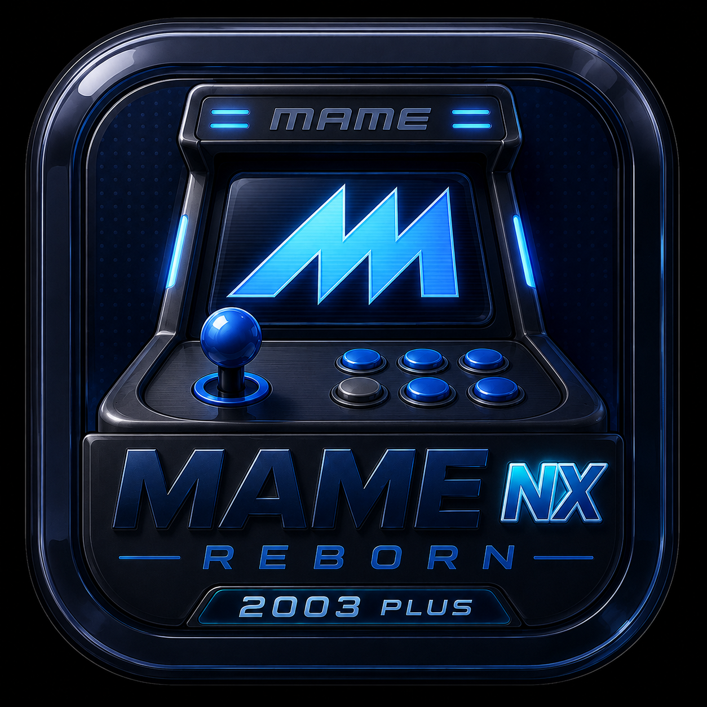
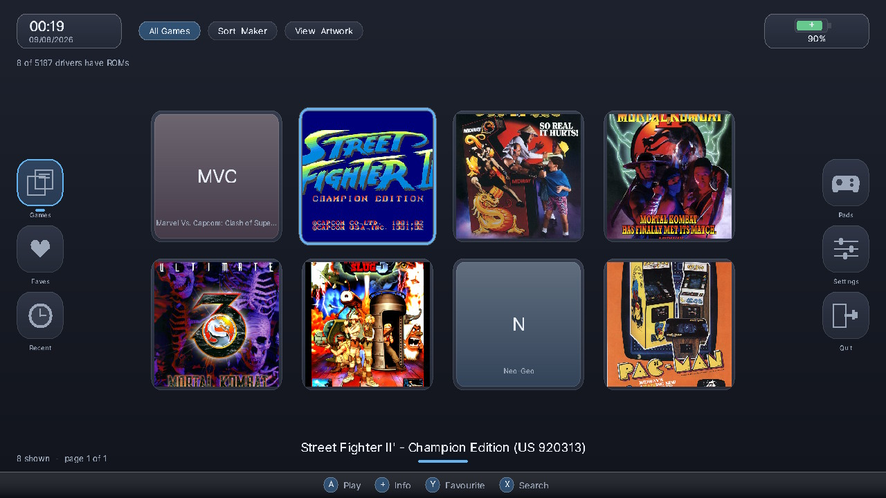
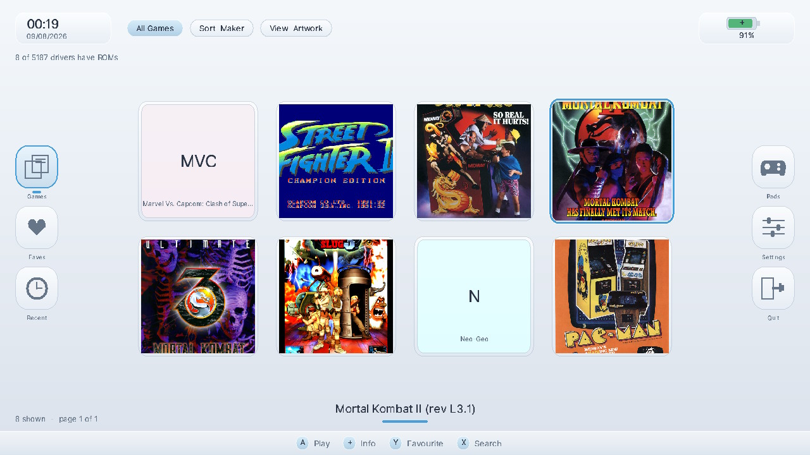
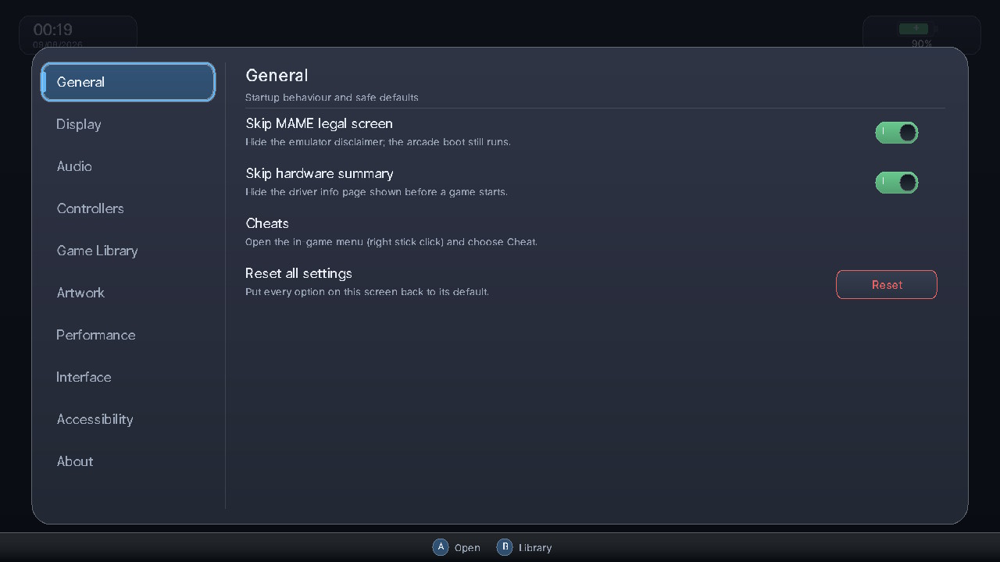
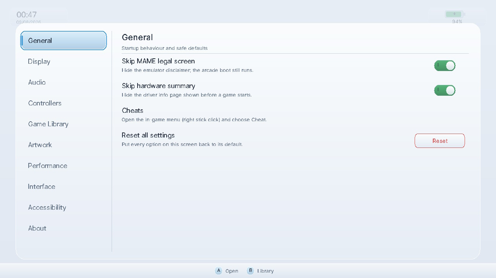
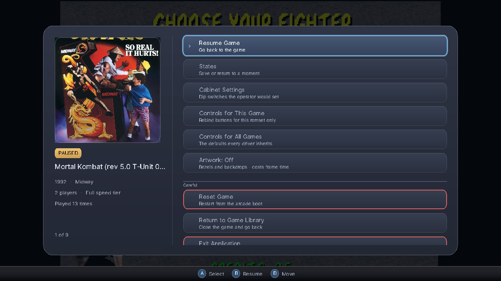
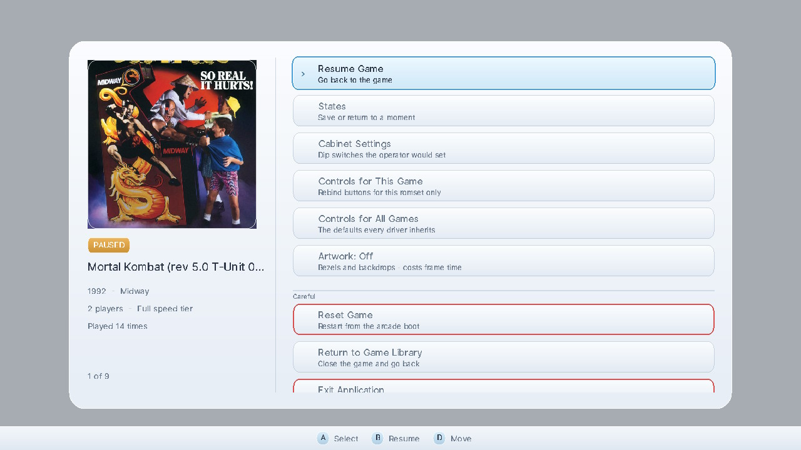

# MAME NX Reborn 2003 Plus

<p align="center">
  
</p>

Standalone MAME2003-Plus arcade emulator and native frontend for Nintendo Switch.

MAME NX Reborn combines the MAME2003-Plus core with a Switch-specific operating-system layer, software-rendered library, native pause tools, performance management, save states, artwork, and controller support. It runs directly as a Homebrew Menu application: RetroArch and libretro are not required at runtime.

> [!IMPORTANT]
> This repository does not include arcade ROMs, BIOS files, samples, `cheat.dat`, or `history.dat`. Use only data you are legally entitled to use.

## Project status

This is an active, hardware-focused port rather than a claim that every registered driver is perfect.

- **Application:** MAME NX Reborn 2003 Plus
- **Author/maintainer:** Blaze414
- **Current package version:** 1.0.0
- **Core lineage:** MAME 0.78-derived MAME2003-Plus
- **Runtime model:** standalone; all libretro/RetroArch frontend glue removed
- **Target:** Nintendo Switch through libnx and devkitA64
- **Registered-driver coverage:** 5,238 of 5,279 entries (99.2%) in the Aug 8 integration snapshot
- **Known unregistered remainder:** 41 entries across five source groups
- **Explicitly gated:** 317 entries marked `GAME_NOT_WORKING`

Registration coverage means a game is represented by the compiled driver table. It does **not** guarantee perfect emulation, full speed, correct protection, working sound, or save-state support. The frontend exposes the core's compatibility flags instead of hiding them.

## Screenshots

### Game library

| Midnight | Pearl |
|---|---|
|  |  |

The library keeps games central while permanent rails expose Games, Favourites, Recent, controller assignment, settings, and quit. Top chips make category, sort, and view state visible; the bottom hint bar explains current controller actions. Cover art is optional, and missing images fall back to generated letter tiles rather than broken placeholders.

### Settings

| Midnight | Pearl |
|---|---|
|  |  |

Settings use stable categories on the left and contextual controls on the right. Toggles, choices, actions, headings, and descriptions share one row system, so accessibility and theme changes apply consistently instead of being implemented page by page.

### Native pause overlay

| Midnight | Pearl |
|---|---|
|  |  |

The overlay preserves the paused game as context, pairs cabinet artwork with live game metadata, and separates routine actions from the careful/destructive group. The same hierarchy and focus behavior survive both themes; Pearl and Midnight are material variants, not separate interfaces.

### Visual identity

The logo establishes the packaging language: a compact arcade cabinet, black chrome, electric blue illumination, and a prominent MAME NX monogram. The application extrapolates that identity without copying its heavy rendered-metal treatment onto every screen:

- electric blue becomes the travelling focus ring and selected-state accent;
- cabinet geometry becomes rounded framed panels and inset controls;
- dark navy/black informs Midnight, while Pearl provides a daylight counterpart;
- arcade artwork supplies colour while surrounding UI remains restrained;
- red outlines are reserved for reset, exit, and other careful actions;
- persistent hints make the controller part of the visual system rather than hidden knowledge.

The full-resolution logo is stored at `docs/assets/mame-nx-reborn-logo.png`. The same source is normalized into the repository's 256×256 baseline `icon.jpg` for Homebrew Menu packaging.

## Highlights

### Standalone MAME2003-Plus core

- Replaces the original MAME 0.72 core used by mame-nx.
- Removes dependence on RetroArch and libretro at runtime.
- Provides a new Switch OSD layer for display, audio, input, timing, files, and lifecycle management.
- Retains the mature MAME2003-Plus driver set while adapting its assumptions to libnx.

### Native Switch frontend

- Grid, compact, and list library views.
- Categories, sorting, search, favourites, recents, play counts, and persistent settings.
- Game-information screen with compatibility and performance indicators.
- Software-rendered text, images, gradients, rounded surfaces, shadows, and focus effects.
- Wii-inspired Pearl and Midnight themes.
- Touch and controller navigation backed by the same actions.
- Text scaling, high contrast, reduced motion, persistent hints, colour-blind focus mark, navigation sounds, and configurable vibration.

### Native pause tools

The pause overlay avoids relying on MAME's legacy renderer for common tasks. It provides native pages for:

- save and load states;
- DIP/cabinet switches;
- cheats;
- per-game control remapping;
- default control remapping;
- analog settings;
- Neo Geo memory cards;
- `history.dat` entries;
- artwork layers;
- reset, return-to-library, and exit actions.

### Switch-specific performance controls

- Per-driver light, medium, heavy, and extreme cost tiers.
- Adaptive CPU boost and catch-up frameskip.
- Thermal backoff at 72 °C, with recovery hysteresis.
- Up-front memory-fit checks, including the 448 MB applet-mode gate.
- Automatic 720p handheld and 1080p docked output.
- Configurable 33, 50, or 66 ms audio queue target.

### Defensive save states

- Ten slots per game.
- Slot timestamps and sizes.
- Validation of magic, ROM-set name, serialized size, and state signature.
- Honest driver-specific failure messages when serialization is unavailable.
- Per-install state isolation.

## Installation

### Requirements

- A Nintendo Switch capable of running homebrew.
- Homebrew Menu, preferably launched through title takeover for the full application heap.
- An SD card with enough free space for the application, ROMs, and optional artwork/states.
- Arcade ROM sets compatible with the MAME2003-Plus/MAME 0.78-era driver set.

### SD-card layout

Create one folder for the installation and keep its data beside the NRO:

```text
sdmc:/switch/mame-nx-reborn/
├── mame.nro
├── roms/
│   ├── example.zip
│   └── ...
├── samples/              # optional external samples
├── cheat.dat             # optional
├── history.dat           # optional
├── artwork/              # optional; created automatically
└── states/               # created after first save
```

The exact folder name is not important. On a normal Homebrew Menu launch, all writable data follows the folder containing `mame.nro`. Two copies in separate folders therefore behave as separate installations with independent settings, library metadata, artwork, and states.

If launch metadata does not provide the NRO path, such as with some forwarders or title-takeover arrangements, the fallback data directory is:

```text
sdmc:/switch/mame-nx
```

### ROM setup

1. Put zipped ROM sets in `roms/` beside the NRO.
2. Preserve standard MAME short-name filenames, such as `<romset>.zip`.
3. Start the application.
4. If files were added while the application was already open, use **Settings → Library → Rescan ROM folder**.

Parent and clone dependencies still follow MAME rules. A matching ZIP filename alone does not prove that every required ROM is present; launch-time audit remains authoritative.

### Launch mode

Launching hbmenu in applet mode provides a restricted heap. Large drivers can be refused before launch when their estimated regions will not fit. Use title takeover for the full heap when possible. Refusal is deliberate: failing in the browser is safer and clearer than crashing inside a large allocation.

## Controls

### In game

| Switch control | Default arcade/UI action |
|---|---|
| D-pad / left stick | Movement |
| A, B, X, Y | Arcade buttons 1–4 |
| L, R | Arcade buttons 5–6 |
| ZL, ZR | Arcade buttons 9–10 |
| Plus | Start |
| Minus | Coin/select |
| Right-stick click | Open or close MAME configuration menu |
| Plus + Minus | Open native pause overlay |

The pause chord is edge-triggered when the second button is pressed. It replaced stick-click chords because sequential stick clicks could activate both pause and quit during one gesture.

### Frontend and pause overlay

| Switch control | Action |
|---|---|
| D-pad / left stick | Move focus |
| A | Select/confirm |
| B | Back/cancel |
| X | Search from the library |
| Y | Toggle favourite |
| Plus | Open game information for focused entry |
| ZL / ZR | Previous/next library page |
| L / R | Previous/next category |
| Minus | Cycle library view |
| Left-stick click | Cycle library sort |

Destructive actions can require a hold confirmation. Touch input follows the same focus-and-activate rules as controller input.

### Multiple controllers

Player 1 uses the first controller and Player 2 can use a separately connected controller, including a Pro Controller. Controller assignment is available from **Settings → Controls**. The port configures the supported controller set once during startup to avoid conflicting libnx player-count reconfiguration.

## Settings and persistent data

The frontend exposes these groups:

- **General:** disclaimer and hardware-summary behavior, cheat guidance, reset defaults.
- **Display:** brightness, gamma, automatic output-resolution information.
- **Audio:** external samples, audio delay, navigation sounds.
- **Controls:** controller assignment, rumble, destructive-action confirmation.
- **Library:** hide non-working entries, sort, view, ROM rescan.
- **Artwork:** cover display, in-game layers, cropping, explicit network downloads.
- **Performance:** effect reduction, memory mode, automatic boost/frame pacing status.
- **Interface:** Pearl/Midnight theme, hints, motion, current library layout.
- **Accessibility:** text scale, contrast, reduced motion, focus mark, sound, vibration.
- **About:** core lineage, active data folder, and most recent SoC temperature.

Main frontend data includes:

| Path relative to application folder | Purpose |
|---|---|
| `settings.txt` | Frontend preferences |
| `library.txt` | Favourites, recents, and play statistics |
| `artwork/` | Local or explicitly downloaded covers |
| `states/` | Per-game save-state slots |
| `roms/` | ROM archives |
| `samples/` | Optional external sample packs |
| `cfg/`, `nvram/`, `hi/` | Core configuration and persistent machine data |

## Save-state behavior and limits

Open **Pause → States → Save State** or **Load State**, then choose one of ten slots. Save and load pages keep independent cursors, and Back returns through `slot page → States → pause menu`.

Before loading, the frontend checks:

1. the `MAMESAVE` header;
2. the running ROM-set short name;
3. serialized byte count;
4. the core's state signature.

These checks stop obvious cross-game, truncated, and incompatible states before they touch live machine memory. Save states are still tied to this core's exact serialization layout and should not be treated as portable across unrelated builds.

Some drivers remain unable to serialize safely. The UI keeps the States entry visible and reports why a game cannot save rather than silently hiding the feature. Normal NVRAM/high-score persistence is preferable when a driver lacks reliable states.

## Artwork and networking

Cover downloading is disabled by default because it creates network traffic. Enabling **Allow artwork downloads** only permits access; downloads still begin from the explicit **Download covers on page** action.

The downloader:

- first uses a cached local image;
- supports parent artwork fallback for clones;
- attempts box art, then title-screen and in-game snapshot sources;
- rejects invalid image data;
- stores results in the current installation's `artwork/` directory.

Hand-copied `<romset>.png` or `<romset>.jpg` files use the same cache path and require no network access.

## Building from source

### Recommended: devkitPro Docker image

Requirements:

- Docker Desktop or another Docker-compatible engine;
- enough disk space for the devkitPro image and a full MAME build.

From the repository root:

```sh
./docker-build.sh
```

For a clean rebuild:

```sh
./docker-build.sh clean
```

Outputs are written to `release/`:

```text
release/mame.nro
release/mame.elf
release/mame.nso
release/mame.pfs0
release/mame.nacp
```

The build script mounts the repository at `/src`, uses devkitPro's official `devkita64` image, and runs a parallel make. It removes MAME archive files before normal incremental builds because old archive member lists can survive source-list changes.

### Native devkitPro build

Install devkitPro/devkitA64 and the Switch port libraries required by the makefile, including FreeType, curl, zlib, glad/EGL, and libnx. Then run:

```sh
make -j$(getconf _NPROCESSORS_ONLN)
```

Tool and package names differ by host operating system; the Docker path is the reproducible reference build.

### Changing the icon

Use the repository helper instead of manually rebuilding metadata:

```sh
./tools/set-icon.sh path/to/new-icon.jpg
```

The lowercase `icon.jpg` filename is intentional. Linux containers are case-sensitive even when the source checkout came from a case-insensitive macOS volume.

## Architecture

### Core and build graph

- `src/driver.c` — registered game-driver table.
- `src/mame.mak`, `src/core.mak`, `src/fullset.mak` — source-family and CPU/sound dependency graph.
- `src/driver.h` — driver flags, including the corrected serialization capability bit.
- `src/state.c` — core save-state registry and serialization engine.
- `makefile` — devkitA64 target, compiler flags, libraries, NRO metadata, and dependency files.

### Switch OSD

- `src/nx/nx_display.c` — game framebuffer upload, presentation, scaling, and overlay compositing.
- `src/nx/nx_sound.c` — audout queue, resampling boundary, delay target, and stream lifecycle.
- `src/nx/nx_input.c` — MAME UI defaults and Nintendo A/B semantics.
- `src/nx/nx_joystick.c` — libnx pad enumeration and once-per-frame HID latch.
- `src/nx/nx_fileio.c` — core path setup.
- `src/nx/nx_timing.c` — OSD timing.
- `src/nx/nx_perf.c` — driver tiers, heap gate, CPU boost, frameskip, and thermal governor.
- `src/nx/nx_paths.c` — per-install writable-path resolution.

### Frontend and native bridges

- `src/CustomUI.h` — library, settings, game info, pause overlay, animation, and interaction state.
- `src/nx/gfx.cpp` — software-rendered frontend primitives and text/image drawing.
- `src/nx/nx_romlist.cpp` — ROM discovery and driver lookup.
- `src/nx/nx_artwork.cpp` — opt-in artwork networking and cache.
- `src/nx/nx_dips.c` — native DIP-switch bridge.
- `src/nx/nx_mameui.c` — input, analog, memory-card, and history bridges.
- `src/nx/nx_state.c` — validated ten-slot state frontend.
- `src/nx/nx_pause_sound.c` and `src/nx/nx_ui_sound.c` — UI audio while emulation is paused or in the browser.

## Development timeline, rationale, and challenges

The following timeline records the Jul 3– Aug 8 porting sprint. Counts describe that integration snapshot and are retained because they explain the scale and order of the work.

### Phase 1 — Core swap 

**Implemented**

- Replaced MAME 0.72 with MAME2003-Plus.
- Removed libretro and RetroArch glue while preserving standalone execution.
- Rebuilt video, audio, input, file I/O, and timing OSD services.
- Split `mame2003.h` and `osdepend.h`, then moved HID to modern libnx `PadState` APIs.
- Reduced roughly 1,000 linker errors to zero.
- Trimmed `driver.c` from 5,311 to 2,700 entries to establish a buildable baseline, then restored 1,970 already-compiled drivers.
- Repaired 431 missing `vidhrdw` references, 88 stale `mame.mak` references, and 72 symbol swaps.
- Raised registered-driver coverage from 54% to 99.2%: 5,238 of 5,279 entries.
- Migrated `audit.c` to the CHD API and added the required player argument to `draw_crosshair()` at more than 44 call sites.
- Added `GAME_NOT_WORKING` launch blocking and BROKEN/PROT/GFX/SND/COL badges; 317 games were gated.

**Why this work existed**

The original port's core was too old for the intended game coverage, but simply copying a libretro core would have violated the standalone requirement. The core had to be treated as an engine embedded behind a native Switch OSD rather than as a RetroArch module.

**Main challenges**

- MAME's game list, make fragments, generated CPU sources, and object archives form one dependency graph. A driver-table entry can compile while its machine, video, or sound object is absent.
- Stale archive members made some builds appear fixed until a true clean rebuild.
- The MAME2003-Plus tree carried APIs from several eras, so failures were not one uniform porting problem: some were missing files, some renamed symbols, some incompatible structures, and some duplicate definitions.
- Restoring all drivers at once produced too much noise. Establishing a smaller linkable set, then adding precompiled families back in measured batches, made each unresolved symbol attributable.

**Outcome**

A clean standalone NRO linked with 99.2% of the target driver table represented. The remaining 0.8% was isolated instead of being allowed to destabilize the whole port.

### Phase 2 — Stabilisation 

**Implemented**

- Added `nx_perf` driver tiering, adaptive boost, thermal backoff, and the 448 MB applet-mode heap gate.
- Corrected audio `SAMPLECOUNT`, expanded the output queue from two buffers to four, fixed sample-versus-byte units, and closed the `osd_stop_audio_stream` leak.
- Fixed a launch-time framebuffer overflow: a 100 KB allocation was used for data that could require about 258 KB.
- Added `-MD -MP` dependency generation so header changes trigger the required recompiles.
- Fixed a photosensitive 60 Hz strobe caused by presenting the browser over the game on alternating frames.

**Why this work existed**

Producing an NRO proved only that the port linked. The next risk was unsafe behavior on real Switch hardware: constrained applet memory, a thermally limited Tegra X1, asynchronous audio buffers, and separate browser/game presentation paths.

**Main challenges**

- Hidden stale objects caused fixes in headers to be omitted from incremental builds, creating false debugging results.
- Buffer bugs crossed unit boundaries: samples, bytes, frames, and texture dimensions were all valid-looking integers with different meanings.
- `Gfx::flush()` was correct for the browser but wrong inside the game loop. Presenting both paths produced an alternating old/new image rather than an obvious crash.
- Performance policy needed observable refusal and thermal behavior. Silent overclocking or allocator failure would make diagnosis impossible for users.

**Outcome**

The port moved from linkable to launchable, with safer memory decisions, stable presentation, and a recoverable audio lifecycle.

### Phase 3 — Frontend 

**Implemented**

- Added a software renderer for pixels, rectangles, rounded geometry, text, images, and gradients.
- Built library grid, compact, and list layouts with search, categories, favourites, recents, and persistence.
- Added game information, settings, pause overlay, and paused-frame compositing.
- Added local/opt-in downloaded artwork, vector icons, hint bars, navigation tones, and haptics.

**Why this work existed**

The original browser could launch games but could not communicate compatibility, memory limits, accessibility options, or new native tools. Reusing MAME's in-game UI for everything would also have split the product into two visual and interaction systems.

**Main challenges**

- The frontend had to coexist with the game's OpenGL presentation without corrupting GL state.
- A CPU software renderer at 720p cannot afford unlimited decorative overdraw, so primitives and effects needed bounded costs.
- Artwork networking had to remain opt-in and explicit. Merely opening a library page must never create network traffic.
- Touch and controller behavior could not become separate implementations; both needed one hit/action model.

**Outcome**

The Switch application gained a coherent launcher and settings surface rather than acting as a thin ROM picker around a legacy core.

### Phase 4 — Input and pause parity 

**Implemented**

- Fixed A/B inversion caused by upstream PC-controller SELECT/CANCEL defaults.
- Moved native pause to `Plus + Minus` and removed ambiguous stick chords.
- Fixed vibration continuing after the menu that started it had closed.
- Added native DIP, cheat, game/default remap, analog, memory-card, and `history.dat` pages.
- Added `nx_dips`, `nx_mameui`, and required cheat accessors.

**Why this work existed**

Nintendo users expect A to confirm and B to cancel. Upstream MAME bound UI meanings by generic button position, producing the opposite behavior on Switch and making frontend and core menus disagree. Native pause parity was required so users did not have to enter the old UI for routine operations.

**Main challenges**

- Input symbols are shared between gameplay and UI. Fixing menu semantics could not steal A/B from arcade buttons.
- A two-stick quit chord had a halfway state: pressing one stick first could pause before the second completed quit.
- Haptics are level-triggered. If the code responsible for sending the stop packet stops running when a menu closes, vibration persists.
- Legacy subsystems exposed internal structures rather than stable UI APIs, requiring small read/change/activate bridges instead of duplicating emulator logic.

**Outcome**

Frontend and emulator controls follow one Nintendo-style convention, while common MAME functions are available without rendering MAME's legacy menu.

### Phase 5 — Motion and material 

**Implemented**

- Added travelling focus, page slides, dialog scale-in, list motion, and value recoil.
- Used interruptible chase animations rather than queued transitions.
- Added rounded gradients, gloss, shadow, and a shared `Glass()` surface helper.
- Added Pearl and Midnight themes and numerically checked text/surface contrast pairs.
- Tuned the focus spring by parameter search: 6.5% scale, about 1.34% overshoot, 217 ms growth, 134 ms shrink, no shrink bounce.

**Why this work existed**

Motion needed to explain focus and hierarchy, not decorate every action. A shared material system also reduced visual drift: changing one helper could update every panel instead of leaving many nearly identical surfaces.

**Main challenges**

- Queued animations feel delayed during fast controller navigation. Every transition therefore had to accept a new target mid-flight.
- Overshoot that looks responsive while growing can look like a defect while shrinking.
- Contrast could not be judged from isolated colour swatches because translucent surfaces blend with different backgrounds.
- Effects had to remain affordable on Switch V1 and removable through reduced-motion/effects settings.

**Outcome**

The interface gained one consistent visual grammar with bounded animation and accessibility fallbacks. Later refinement made Pearl the default while retaining Midnight.

### Phase 6 — Save states 

**Implemented**

- Fixed `tms34010.c` registering its shift register 24 lines before allocation.
- Removed an 8 KB-per-reset leak and corrected `sizeof(SHIFTREG_SIZE)` misuse.
- Reassigned `GAME_DOESNT_SERIALIZE` from `0x0420`—a collision of existing flags—to a real independent bit at `0x0800`.
- Registered T-unit and Wolf-unit machine state in `midtunit` and `midwunit_machine`.
- Added missing serial PIC, PIC2, and I/O ASIC registrations in `midwayic.c`.
- Built `nx_state.c` with ten slots, metadata display, validation, and visible diagnostics.

**Why this work existed**

The core had a serialization engine, but availability was only as strong as every driver's registration. A frontend button could not make unsafe or incomplete driver state valid. The work therefore fixed root registrations first, then added a guarded user interface.

**Main challenges**

- `state_get_dump_size()` returned zero at the first registered null pointer, so one early registration disabled an entire hardware family with little diagnostic context.
- The old serialization flag was not a single bit. Testing it accidentally classified games with imperfect sound or wrong colours as unable to save.
- Midway hardware state spans CPUs, machine helpers, serial security devices, and I/O ASICs; partial registration can appear to save successfully and fail only after loading.
- A state from a clone may share size/signature with another set. Game-name validation was needed in addition to core signature checks.

**Outcome**

Save-state support became explicit and diagnosable, including roughly 123 TMS34010-family games across 11 drivers that had been blocked by the early shift-register registration.

### Phase 7 — Latency and audio 

**Implemented**

- Walked the full linked list returned by `audoutGetReleasedAudioOutBuffer`.
- Latched controller state once per emulated frame instead of calling `padUpdate()` for every queried code.
- Added 33, 50, and 66 ms audio-delay choices.

**Why this work existed**

Intermittent crackle and unreliable simultaneous presses were timing symptoms, not mapping or emulation errors. Both came from treating frame-level APIs as if they were independent per-item queries.

**Main challenges**

- The audio API returns a linked list of released buffers. Processing only its head permanently shrank a four-buffer queue after every overrun: 4 → 3 → 2 → 1.
- MAME can query around 100 input codes in one frame. Updating HID for each query meant each logical frame combined different physical snapshots.
- Lower latency reduces safety margin, so one hard-coded delay could not suit every driver and storage/load condition.

**Outcome**

Audio buffers return to the queue correctly, chorded input is coherent within a frame, and users can trade latency for crackle resistance.

### Phase 8 — Housekeeping 

**Implemented**

- Added `nx_paths` so writable data follows the NRO folder.
- Ensured application exit calls `mame_done()`.
- Added an `atexit` vibration stop.
- Reduced three conflicting `padConfigureInput` calls to one configuration.
- Bound vibration devices for both Handheld and No1 targets to survive dock transitions.
- Branded the package as MAME NX Reborn 2003 Plus by Blaze414.
- Fixed case-sensitive `icon.jpg` handling and added `tools/set-icon.sh`.

**Why this work existed**

Lifecycle and path bugs often survive functional testing but damage real installations: two builds can overwrite each other's state, teardown can be skipped on app exit, and dock transitions can invalidate device assumptions made at startup.

**Main challenges**

- Homebrew launch modes do not always provide the same `argv[0]`, requiring a compatible fallback path.
- ROM scanning already used the working directory while settings and states used a fixed path, creating a split-brain installation model.
- Vibration handles remain tied to the npad ID used at initialization. After docking, stop packets could be sent to a device no longer held by the player.
- macOS tolerated `Icon.jpg` while the Linux build container required exact filename case.

**Outcome**

An installation is now a self-contained folder, exit paths perform core teardown, and controller/haptic behavior remains stable across docking and process shutdown.

## Engineering lessons

- **Clean builds are evidence.** Archive and header staleness can make both failures and fixes appear nondeterministic.
- **Capability flags must be true bits.** Composite numeric values are unsafe in bitmask tests.
- **Latch frame-level state once.** Input, timing, and presentation should describe one coherent emulated frame.
- **Read complete API results.** A linked-list return cannot be treated as one buffer without silently losing capacity.
- **Validate before mutating live state.** Save-state identity and size checks are cheaper than recovering a corrupted machine.
- **Make refusal observable.** Memory, thermal, compatibility, and serialization gates should explain themselves.
- **Keep network behavior explicit.** Local browsing remains offline unless the user enables and starts downloads.
- **Share interaction paths.** Touch and controller input should resolve to the same action functions.
- **Use numerical accessibility checks.** Visual judgment alone missed three contrast failures.
- **Preserve standalone boundaries.** Native bridges can expose core behavior without importing an entire external frontend.

## Known limitations

- Forty-one driver entries remained outside the registered Aug 8 build snapshot.
- Games marked `GAME_NOT_WORKING` are blocked intentionally.
- Compatibility badges originate in driver flags and may not describe every runtime defect.
- Extreme-tier drivers may not reach full speed on Switch V1.
- Applet mode cannot launch some memory-heavy drivers; use title takeover.
- Save-state coverage remains driver-dependent, and states are not guaranteed portable across builds.
- Some arcade sets require parent ROMs, BIOS archives, CHDs, samples, or correct dump revisions.
- In-game artwork layers can reduce performance, especially on V1 hardware.
- Online cover availability depends on external sources and is not guaranteed.

## Troubleshooting

### A ROM does not appear

- Confirm it is a `.zip` file under the installation's `roms/` directory.
- Confirm its filename is the MAME short name.
- Use **Rescan ROM folder**.
- Check whether it belongs to the 41 unregistered entries.

### A game appears but does not launch

- Read the compatibility and memory message on the game-information screen.
- Try title takeover if the app reports restricted heap.
- Verify parent, clone, BIOS, and CHD requirements.
- A BROKEN entry is intentionally gated.

### Audio crackles

- Increase **Settings → Audio → Audio delay** from 33 to 50 or 66 ms.
- Close expensive in-game artwork layers.
- Check whether the driver is classified heavy or extreme.

### Save State is unavailable

- Read the explanation shown on the States page.
- The driver may be marked unable to serialize or may register incomplete state.
- Use the game's normal NVRAM/high-score persistence when possible.

### Build changes do not appear

- Run `./docker-build.sh clean`.
- Confirm Docker rebuilt `release/mame.nro`.
- Do not copy only an older artifact from another installation folder.

## Contributing

Useful contributions include:

- reproducible hardware test reports naming ROM set, parent/clone status, Switch model, launch mode, and observed behavior;
- fixes for the remaining driver/source families;
- complete save-state registrations, not UI-only enablement;
- performance measurements on V1 and later hardware;
- accessibility and localization improvements;
- documentation corrections tied to current source behavior.

Keep platform policy in `src/nx/` where possible. Changes to shared MAME code should be narrowly scoped and documented because they affect many driver families.

## Credits and lineage

- **Blaze414** — MAME NX Reborn integration, Switch frontend, OSD work, and current maintenance.
- **MVG / lantus mame-nx** — original Nintendo Switch mame-nx foundation.
- **MAME2003-Plus contributors** — MAME 0.78-derived core and expanded driver work.
- **MAME contributors** — original emulation cores, drivers, devices, and supporting tools.
- **devkitPro and libnx contributors** — Nintendo Switch homebrew toolchain and platform APIs.

Review the upstream projects and source-file notices for applicable licensing terms. ROMs, BIOS data, game artwork, trademarks, and commercial game content are not distributed by this repository and remain the property of their respective owners.
